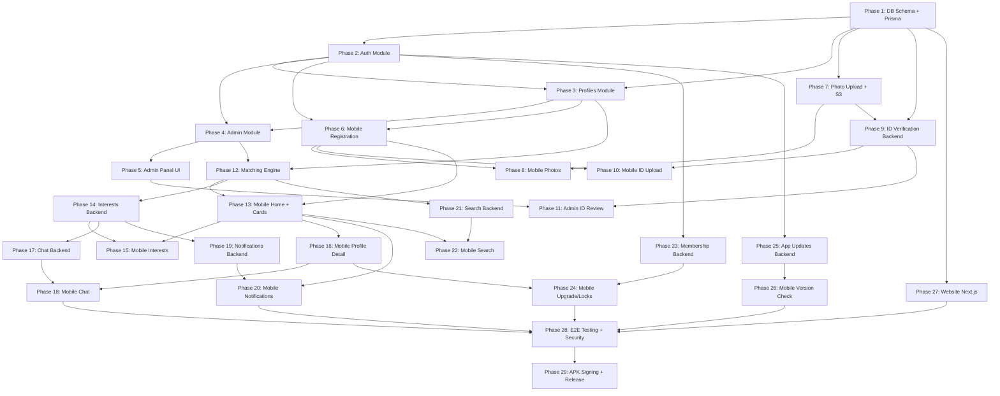

# Dhobi Matrimony — Implementation Roadmap

> Derived from [Dhobi_Matrimony_Complete_Plan.md](file:///c:/Users/Admin/Desktop/College/Degree/Sem_4/Dhobi_Matrimony/Dhobi_Matrimony_Complete_Plan.md) and [Dhobi_Matrimony_Engineering_Blueprint_v3.md](file:///c:/Users/Admin/Desktop/College/Degree/Sem_4/Dhobi_Matrimony/Dhobi_Matrimony_Engineering_Blueprint_v3.md)

---

## Project Summary

**Dhobi Matrimony** is a full-stack matrimony platform targeting the Dhobi community. It comprises four deliverables:

| Deliverable | Technology |
|---|---|
| Mobile App | React Native (Expo SDK) + TypeScript |
| Backend API | NestJS + Prisma + PostgreSQL + Socket.IO |
| Admin Panel | React + Tailwind CSS |
| Public Website | Next.js |

The Blueprint v3 overrides the Complete Plan's Flutter/Dart/Riverpod stack with React Native/Expo/TypeScript/React Query/Zustand. All features, screens, DB schema, and business rules from the Complete Plan remain unchanged.

---

## All Phases (29 total)

### Phase 1 — Database Schema + Prisma Setup
**Scope:** Translate all 14 PostgreSQL tables from the spec into a Prisma schema. Generate initial migration. Set up the `backend-api/` NestJS project skeleton with Prisma, environment config, and Docker Compose for local PostgreSQL + Redis.

**Tables:** `users`, `profiles`, `partner_preferences`, `profile_photos`, `id_verifications`, `interests`, `shortlists`, `hidden_profiles`, `conversations`, `messages`, `notifications`, `daily_recommendations`, `profile_views`, `app_versions`, `admin_audit_log`

**Deliverables:**
- `prisma/schema.prisma` with all models, relations, enums, and constraints
- `docker-compose.yml` (PostgreSQL 16 + Redis)
- `.env.example` with all required variables
- NestJS project bootstrapped (`app.module.ts`, config files)
- Prisma migration `001_initial_schema` applied and verified

---

### Phase 2 — Backend: Auth Module
**Scope:** Register, OTP generation/verification, login (email+password), JWT token issuance, refresh tokens, logout.

**Features:** F03 (Account Creation + OTP)
**Key files:** `auth.module.ts`, `auth.controller.ts`, `auth.service.ts`, `otp.service.ts`, `jwt.strategy.ts`, DTOs
**Business rules:** Rate limit 5 OTP requests per mobile per 10 min, bcrypt (12 rounds), `profile_created_by` saved on register

---

### Phase 3 — Backend: Profiles Module
**Scope:** 5-step registration wizard save. Each step independently saveable. Profile UID auto-generation (e.g., `DHB1234567`). Profile completion percentage calculation.

**Features:** F04 (Registration Wizard), F23 (Profile Completion %)
**Key files:** `profiles.module.ts`, `profiles.controller.ts`, `profiles.service.ts`, step DTOs

---

### Phase 4 — Backend: Admin Module + Approval Workflow
**Scope:** Admin guard (role check), approve/reject profiles, rejection reason, audit log entries, account status transitions (`pending` → `active` | `rejected`).

**Features:** F10 (Admin Approval Workflow)
**Key files:** `admin.module.ts`, `admin.controller.ts`, `admin.service.ts`, `admin-guard.ts`

---

### Phase 5 — Admin Panel: Login + Pending Profiles + Approval UI
**Scope:** React + Tailwind admin web app. Admin login (separate JWT secret). Dashboard with stats. Pending profiles queue. Review profile page (all fields + photos). Approve/Reject buttons with reason modal.

**Features:** F26 (partial — login, dashboard, pending profiles, approval)
**Key files:** `AdminLogin.jsx`, `Dashboard.jsx`, `PendingList.jsx`, `ReviewProfile.jsx`, `Sidebar.jsx`

---

### Phase 6 — Mobile App: Landing → Registration → OTP → Pending
**Scope:** Expo SDK project init. Full registration flow: Splash → Landing → Profile For → Basic Details → OTP → 5-step wizard → Success → Pending Approval screen. Brand theming (maroon `#8B0000`, gold `#D4AF37`).

**Features:** F01 (Landing), F02 (Profile For Selector), F03 (Account Creation + OTP), F04 (Registration Wizard), F05 (Success Screen), F09 (Pending Approval)
**Key screens:** 10 screens total (Screens 1–10 from spec)

---

### Phase 7 — Backend: Photo Upload + S3 Integration
**Scope:** Photo upload to AWS S3 (private bucket, signed URLs), thumbnail generation, primary photo flag, sort order, validation status (`pending` → `approved` | `rejected`).

**Features:** F06 (Photo Management)
**Key files:** `photos.module.ts`, `photos.controller.ts`, `photos.service.ts`, S3 config

---

### Phase 8 — Mobile App: Photo Management Screen
**Scope:** Grid of photo tiles, drag-to-reorder, upload from gallery/camera, "Profile Photo" label on first tile, "Under Validation" badge, upload toast.

**Features:** F06 (Photo Management — mobile side)
**Key screen:** Screen 11 from spec

---

### Phase 9 — Backend: ID Verification (Upload + OCR + Face Match)
**Scope:** Document upload endpoints, OCR service (name + DOB extraction), face-match service (selfie vs ID photo), age verification (18+), status workflow. Documents stored in private S3 bucket.

**Features:** F08 (Government ID Verification)
**Key files:** `id-verification.module.ts`, `ocr.service.ts`, `face-match.service.ts`

---

### Phase 10 — Mobile App: ID Upload + Selfie Screen
**Scope:** ID type selection (Aadhaar/PAN/DL/Voter ID/Other), front/back image upload, live selfie capture (camera only, no gallery).

**Features:** F08 (ID Verification — mobile side)
**Key screens:** `id_type_selection_screen`, `id_upload_screen`, `selfie_screen`

---

### Phase 11 — Admin Panel: ID Review Panel
**Scope:** Side-by-side comparison view: uploaded document + selfie + OCR extracted data. Approve/reject with admin notes.

**Features:** F26 (ID Verification review)
**Key files:** `IDVerificationList.jsx`, `IDReviewDetail.jsx`, `IDComparePanel.jsx`

---

### Phase 12 — Backend: Matching Engine + Daily Recommendations
**Scope:** Recommendation algorithm using partner preferences, scoring, gender-rule enforcement (server-side — males only see females and vice versa), 9 profiles per day limit, hidden profiles exclusion, previous interest exclusion.

**Features:** F11 (Daily Recommendations), F16 (Don't Show), F19 (Partner Preferences — used in scoring)
**Key files:** `matching.service.ts`, `recommendation.engine.ts`, `GenderVisibilityGuard`

---

### Phase 13 — Mobile App: Home Dashboard + Recommendation Cards
**Scope:** Home screen with Regular/Prime toggle, user avatar, notification bell. Daily Recommendations card stack (swipeable). Card UI with photo, badges, info row, action buttons. Swipe-right = Send Interest with overlay.

**Features:** F11 (Daily Recommendations — mobile side), F13 (partial), F24 (Last Seen display)
**Key screens:** Screens 13–14 from spec

---

### Phase 14 — Backend: Interests Module
**Scope:** Send/accept/decline interest. DB record with status transitions. Prevent duplicate interests. `sent_via` tracking (button vs swipe). Trigger notification on interest events.

**Features:** F13 (Send Interest), F14 (Interests Management)

---

### Phase 15 — Mobile App: Interests Screen
**Scope:** Two tabs: Received / Sent. Filter chips: All / Pending / Accepted-Replied / Declined. Accept/Decline actions on received interests. Empty state illustration.

**Features:** F14 (Interests Management — mobile side)
**Key screen:** Screen 16 from spec

---

### Phase 16 — Mobile App: Full Profile Detail Screen
**Scope:** Photo carousel, verified badges, all 8 sections (Personal Info, Professional, Contact, About, Looking For, Lifestyle, Partner Preferences with "X/21 match" counter, "Both of you like" shared interests). Sticky footer actions. "Upgrade to view" locks on premium fields.

**Features:** F12 (Full Profile Detail), F22 (partial — locked fields)
**Key screen:** Screen 15 from spec

---

### Phase 17 — Backend: Chat WebSocket Gateway
**Scope:** NestJS WebSocket gateway with Socket.IO. Events: `send_message`, `mark_read`, connection/disconnection handling. Messages persisted to PostgreSQL immediately. Conversation creation on first message. `last_seen` update on socket connect/disconnect.

**Features:** F17 (Real-time Chat), F24 (Last Seen — socket-level)

---

### Phase 18 — Mobile App: Chat Screens
**Scope:** Conversations list screen (sorted by last message). Individual chat screen with real-time message delivery. Read receipts. "Send Message" button appears only after mutual interest acceptance.

**Features:** F17 (Real-time Chat — mobile side)

---

### Phase 19 — Backend: Notifications (FCM + In-app)
**Scope:** Firebase Cloud Messaging integration. In-app notification storage. Notification types: interest_received, interest_accepted, profile_approved, new_message, profile_viewed. Unread count tracking.

**Features:** F21 (Notifications)
**Key files:** `notifications.service.ts`, `fcm.service.ts`

---

### Phase 20 — Mobile App: Notifications Screen
**Scope:** Notification bell with unread badge count. Notification list screen with type-specific icons. Tap to navigate to relevant screen. Mark as read on view.

**Features:** F21 (Notifications — mobile side)

---

### Phase 21 — Backend: Search Module
**Scope:** Multi-criteria search/filter API. Filters: age range, height, caste, subcaste, religion, location, education, occupation, income. Results sorted by match score. Gender-rule applied.

**Features:** F18 (Search & Filters)

---

### Phase 22 — Mobile App: Search Screen
**Scope:** Search filters UI with searchable dropdowns. Results list. Separate from daily recommendations.

**Features:** F18 (Search & Filters — mobile side)

---

### Phase 23 — Backend: Membership / Prime Tier
**Scope:** Membership upgrade/downgrade endpoints. Feature gating logic: unmasked contacts, horoscope visibility, better placement in recommendations, profile views visibility.

**Features:** F22 (Membership Tiers)

---

### Phase 24 — Mobile App: Upgrade Prompts + Locked Fields
**Scope:** Regular/Prime toggle UI. "Upgrade to view" lock icons on premium fields (DOB, Time of Birth, Star, Raasi, Kundli Score, Horoscope, full mobile number). PRIME badge on cards. Upgrade CTA flows.

**Features:** F22 (Membership — mobile side)

---

### Phase 25 — Backend: App Updates Module
**Scope:** Version check endpoint. Version record with `is_force_update` flag. Signed APK URL serving. Release notes storage.

**Features:** F25 (APK Update Mechanism)

---

### Phase 26 — Mobile App: Version Check on Launch
**Scope:** App checks version endpoint on every launch. Show update prompt with release notes. Force-update blocks app usage until update installed.

**Features:** F25 (APK Update — mobile side)

---

### Phase 27 — Public Website (Next.js)
**Scope:** Marketing site using Image 1 design. Pages: Home, About, Contact, Success Stories, Privacy Policy, Terms. Trust badges, hero banner, "Free Register Now" CTA, contact info.

**Features:** F27 (Website)

---

### Phase 28 — Full End-to-End Testing + Security Audit
**Scope:** Integration tests across all modules. Security checklist: JWT validation, gender guard bypass testing, S3 signed URL expiry, rate limiting, HTTPS enforcement, DPDP Act compliance (`DELETE /account`). Load testing on matching engine and chat.

---

### Phase 29 — APK Signing + First Release Build
**Scope:** Generate signed APK with private keystore. Checksum verification. First production deployment. Nginx reverse proxy. Docker production compose.

---

## Dependency Graph

## Dependency Table

| Phase | Depends On (must be complete first) |
|---|---|
| 1 | — (start here) |
| 2 | 1 |
| 3 | 1, 2 |
| 4 | 2, 3 |
| 5 | 4 |
| 6 | 2, 3 |
| 7 | 1 |
| 8 | 6, 7 |
| 9 | 1, 7 |
| 10 | 6, 9 |
| 11 | 5, 9 |
| 12 | 3, 4 |
| 13 | 6, 12 |
| 14 | 12 |
| 15 | 13, 14 |
| 16 | 13 |
| 17 | 14 |
| 18 | 16, 17 |
| 19 | 14 |
| 20 | 13, 19 |
| 21 | 12 |
| 22 | 13, 21 |
| 23 | 2 |
| 24 | 16, 23 |
| 25 | 2 |
| 26 | 25 |
| 27 | 1 |
| 28 | 18, 20, 24, 26, 27 |
| 29 | 28 |

### Parallelization Opportunities

Several phases can run concurrently:
- **Phase 5 + Phase 6** (admin panel and mobile registration — both depend on Phase 4/3 but are independent of each other)
- **Phase 7 + Phase 12** (photo backend and matching engine — independent after Phase 3)
- **Phase 23 + Phase 25 + Phase 27** (membership, app updates, website — all independent, only need Phase 2 or Phase 1)

---

## Risks

| # | Risk | Severity | Mitigation |
|---|---|---|---|
| R1 | **OCR + Face Match accuracy** — third-party OCR/face-match services may have low accuracy on Indian government IDs (Aadhaar, PAN) leading to false rejections | High | Evaluate multiple providers (AWS Rekognition, Google Vision, open-source). Keep manual admin review as fallback. Set configurable confidence thresholds. |
| R2 | **OTP SMS delivery** — SMS gateway reliability varies across Indian telecom operators. DND-registered numbers may not receive OTP | High | Use a proven Indian SMS provider (MSG91, Twilio India). Implement "Verify with Missed Call" as backup (already in spec). Add email OTP fallback. |
| R3 | **Caste/Subcaste/Gothra master data undefined** — spec uses Brahmin sub-castes as placeholder; Dhobi community categories not yet provided | High | **Block Phase 3 until client provides the exact list.** Use a seed-data approach so lists are easily swappable. |
| R4 | **React Native performance on low-end Android** — target demographic likely uses budget phones. Heavy photo carousels, swipe gestures, and WebSocket connections may lag | Medium | Use Expo's optimized image components (`expo-image`). Lazy-load off-screen content. Test on Redmi/Samsung budget devices early. |
| R5 | **AWS S3 cost for photo/document storage** — many users uploading multiple photos + ID documents could escalate storage costs | Medium | Compress and resize images server-side before S3 upload. Set lifecycle policies for rejected document cleanup. Monitor billing alerts. |
| R6 | **WebSocket scalability** — Socket.IO with a single NestJS instance won't scale beyond ~5K concurrent connections | Medium | Use Redis adapter for Socket.IO from the start. Architect for horizontal pod scaling behind Nginx. |
| R7 | **DPDP Act compliance** — Indian data protection law requires data deletion on request, consent management, and purpose limitation | Medium | Build `DELETE /account` endpoint early. Log consent at registration. Encrypt PII fields. Document data retention policies. |
| R8 | **Payment gateway integration undefined** — spec mentions Regular vs Prime but no payment gateway is decided | Medium | Defer to Phase 23. Recommend Razorpay for Indian market. Keep membership upgrade/downgrade as manual admin action initially. |
| R9 | **Scope creep from "Assisted Service" feature** — banner in spec but no detailed requirements. Building it adds significant complexity (CRM, agent assignment, workflows) | Low | **Exclude from MVP.** Show the banner as a static promotional element only. Defer to a future release. |
| R10 | **Expo SDK limitations** — some native features (live selfie capture, background socket) may need custom native modules that Expo's managed workflow doesn't support | Medium | Use Expo's development build (custom dev client) to include native modules like `react-native-camera` for selfie capture. Plan for ejection if needed. |

---

## Assumptions

| # | Assumption | Impact if Wrong |
|---|---|---|
| A1 | **Minimum age is 18 for women and 21 for men** (legal marriage age in India under current law). The spec flags this as an open question. | Need to update validation logic; minor code change. |
| A2 | **Freemium model** — Regular (free) + Prime (paid). No payment gateway in Phase 1–22; admin manually upgrades users. Payment gateway added in Phase 23. | If fully free, remove all "Upgrade to view" / lock logic, simplifying Phases 16 and 24 significantly. |
| A3 | **Full in-app chat system is required** (not just phone number reveal). Phases 17–18 build it. | If chat is replaced with phone reveal only, Phases 17–18 are eliminated entirely. |
| A4 | **"Assisted Service" (Relationship Manager) is out of MVP scope** — shown as static banner only. | If required in MVP, add 2–3 phases for CRM backend + assignment logic + dedicated UI. |
| A5 | **Lifestyle fields** (cuisine, hobbies, music, movies, books) are filled via "Edit Profile" after registration, not during the 5-step wizard. | If moved into registration, Step 5 screen becomes much larger; need UI redesign. |
| A6 | **APK distribution via direct download link** (not Play Store initially). The website and/or backend serves the signed APK. | If Play Store is required, add store listing prep, review process, and compliance work. |
| A7 | **Single-language (English) for MVP**. No localization/i18n. | If Hindi/Gujarati needed, add i18n framework across all 4 deliverables. 2–3 week effort. |
| A8 | **AWS is the cloud provider** for S3 storage, hosting, and deployment. | If different provider (GCP, Azure, self-hosted), change storage service implementations. |
| A9 | **The client will provide** brand assets (logo, banner, couple photos), Dhobi community caste/subcaste/gothra lists, and privacy policy / terms text before Phase 6. | Delays in asset delivery will block mobile UI and website phases. |
| A10 | **No offline support required** — the app requires an internet connection at all times. | If offline mode needed, add local DB (SQLite/WatermelonDB), sync logic, and conflict resolution — major scope increase. |

---

## Open Questions (from Spec Section I — must resolve before Phase 3)

> [!IMPORTANT]
> These 7 questions from the original spec remain unresolved. Answers are needed before the respective phases begin.

1. **Caste/subcaste/gothra lists** — What are the exact Dhobi community sub-groups, subcastes, and gothra names? *(Blocks Phase 3)*
2. **Minimum age** — 18 for all, or 18 for women / 21 for men? *(Blocks Phase 3)*
3. **Payment model** — Fully free or freemium? If paid, which gateway (Razorpay)? *(Blocks Phase 23)*
4. **Lifestyle fields timing** — During registration or in Edit Profile later? *(Affects Phase 3 & 6)*
5. **Chat scope** — Full chat system or just reveal phone number? *(Affects Phases 17–18)*
6. **Assisted Service** — Build CRM in MVP or static banner only? *(Affects scope)*
7. **APK distribution** — Direct link or landing page download? *(Affects Phase 27 & 29)*

---

## Phase 1 Detail (Ready for Execution)

Phase 1 is the foundation. Here's what it includes:

### 1.1 — Project Scaffold
- Initialize `backend-api/` with NestJS CLI
- Install Prisma, configure `prisma/schema.prisma`
- Create `docker-compose.yml` with PostgreSQL 16 + Redis 7
- Create `.env.example` with `DATABASE_URL`, `REDIS_URL`, `JWT_SECRET`, `S3_*`, `FCM_*`

### 1.2 — Prisma Schema
Translate all 14 tables + `admin_audit_log` (15 total) into Prisma models with:
- All enums as Prisma enums
- All relations (`@relation`) with cascading deletes
- All unique constraints and composite uniques
- All array fields (`String[]` for PostgreSQL `TEXT[]`)
- All defaults (`@default(uuid())`, `@default(now())`, etc.)
- Indexes on foreign keys and frequently queried columns

### 1.3 — Migration
- Run `prisma migrate dev --name 001_initial_schema`
- Verify all tables created in PostgreSQL
- Seed script with test data (1 admin user, sample caste/location data)

### 1.4 — Verification
- `prisma studio` opens and shows all tables
- `docker compose up` starts PostgreSQL + Redis successfully
- NestJS app compiles and connects to DB

---

*Awaiting your approval to begin Phase 1.*
